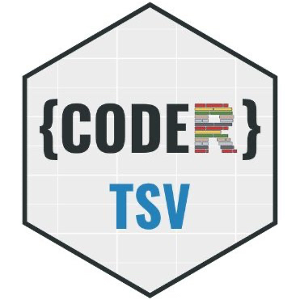

 codertsv: The draw challenge
==========

### The Background

Every week codertsv gives away a codertsv mug and/or codertsv stickers to a lucky participant who attended a session. 

### The Challenge

Create an script/app/notebook/package/website which receives a vector with names (e.g. `attendees = (“Tulip”, “Orchid”, “Rose”)`, draw a random winner (i.e. equal odds for all names in the vector), and produces an image/animation/website (i.e. a visual or audiovisual outcome) as result showing the lucky winner.

### The Prize

There will be two winner categories: one awarded by our judging panel, and one selected by popular vote. The winner(s) can select ONE of the following prices: (1) a photography portrait session - headshots and profile pics, or (2) a food voucher value in AUS $100.

### The Rules

- All entrances must made use of a programming language, any programming language (e.g. you can go vintage and use Logo if you wish).
- All entrances must be able to receive as input a vector/list of names (characters/strings), and produce an image or animation or audiovisual product as output that indicates the lucky draw winner.
- All entrances must be submitted to codertsv GitHub repository: the-draw-challenge, not later than June 23rd.
- Entrances can be submitted as individual or as a team of people. If the winner is a team, members would have to share the prize.
- There is not maximum number of submissions per participant(s)

### How to submit your entry

All submissions must be done as Pull requests (PRs) in this repository. You will need to fork this repository. If you require assistance creating a GitHub repository, forking or doing a Pull Request please feel free to ask for help in our Slack workspace.

All participants must create a participant folder within the sub-directory `submissions`. This directory must be named following the convention `name_lastname`.

Inside this directory you must include all files and directories that allow us to run your script/website/app/etc and produce your intend outcome (e.g. image, animation, etc).

You will also need to complete a Markdown file with information about your submission. Please see the required fields in the example `submissions\name_lastname\README.md`. You should use this file as template.

You must also include all packages/libraries you use in the requirement file: `submissions\name_lastname\requirement.txt`. Please use this file as template.

Please be thoughtful in the amount of files (and their sizes) you include in your submission. Try to minimize the amount of files, directories and space in your submission.

Please annotate/document your code following good practices and programming language standards. 

### Judging criteria

All entries will be judged using three criteria.
 
- “Wow effect” (scale 1-10): Entries will be judged on the creativity and originality of the outcome produced in the submission. In particular, how well designed the outcome is, how engaging is it, and how original is it.
 
- User experience and values (scale 1-10): Entries will be judged on the simplicity of the user experience and how well the submission and outcome represent codertsv [Statement of Philosophy](https://github.com/codertsv/GroupPolicies/blob/master/statement_of_philosophy.md) and [Code of Conduct](https://github.com/codertsv/GroupPolicies/blob/master/code-of-conduct.md).

- Technical merit and documentation (scale 1-10): Entries will be evaluated on the technical implementation of the submission and good programming practices. In particular, does the submission use elegant solutions to achieve the outcome, does the submission minimize boiler plate code and number of files required, and is the submission well documented.

### Terms and conditions

- This challenge is open to all members of our codertsv community across all JCU campuses.
- If the winner(s) is/are not located in the JCU Townsville campus, the winner will only be able to receive prize option 2, AUS $100 food voucher.
- By submitting an entrance you agreed to release the rights to use, redistribute, modify and share your entrance code/app/script/concept to codertsv.
- Codertsv accepts no responsibility for any damage caused during entrance preparation or submission.
- The winner(s) will be notified in the codertsv Slack Announcement channel, and by email.
- The judging committee is conform by two members of codertsv organising committee, and one external staff.
- Any aspect not considered in the challenge rules, and terms and conditions will be resolved by codertsv organising committee.
